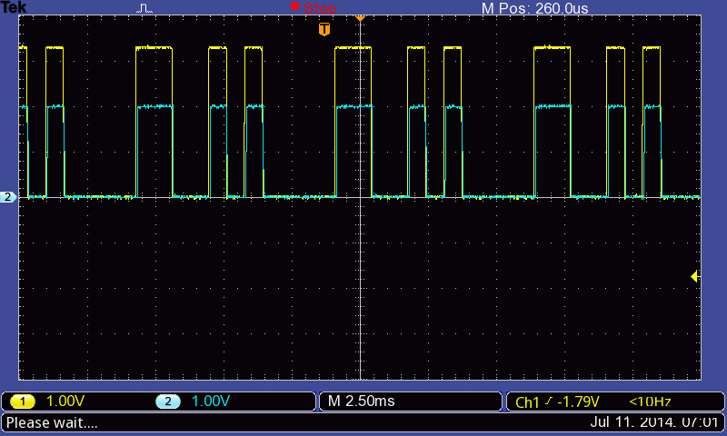
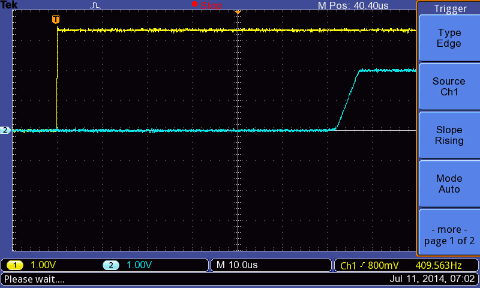
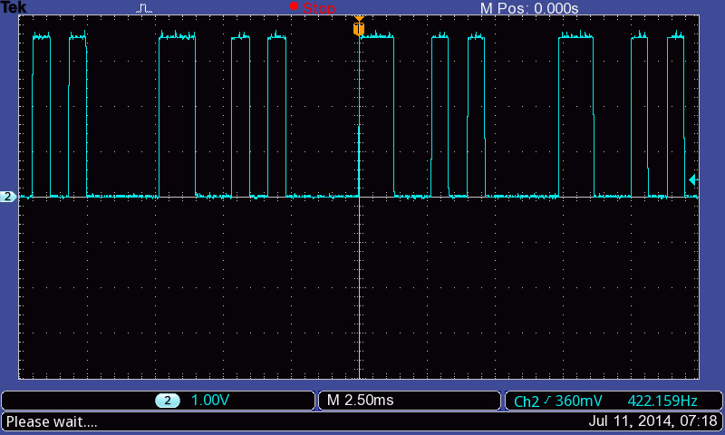
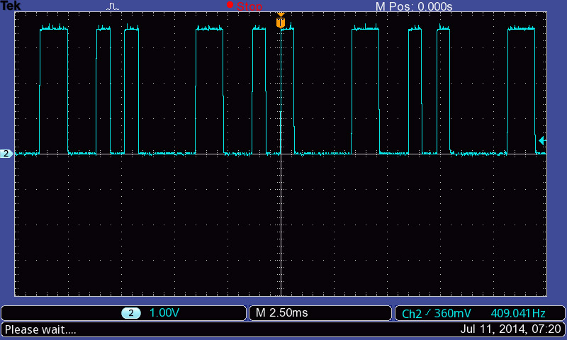
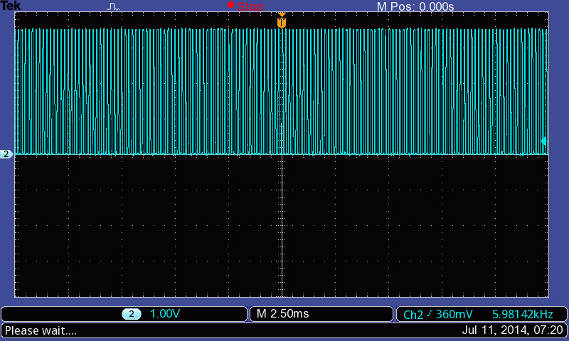

# Test of the 433 MHz radio transmitters

They reproduce a digital waveform. The easiest way to use them would be to
connect to the microprocessor's UART.

I set up a FRDM board to transmit ASCII 'a' continuously to take these
screenshots.

Here, Ch 1 (yellow) is the transmitter UART signal and Ch 2 (blue) is the
receiver signal. I used the FRDM boards which are 3.3 V. The transmitter Vcc is
5 V (powered from the USB). Running the transmitter off 3.3 V reduces the
performance considerably. I powered the receiver from the 3.3 V rail for these
tests.

Zooming in on the transition, we see a delay of approximately 60 - 70 μs between
transmit and receive signals. This will limit the baud rate that it is possible
to use because it is likely that any logic HIGH of shorter durations than this
will be missed. (However, I did not test this.)

## Increasing the distance between transmitter and receiver

### Here's how it looks with the transmitter and receiver about 2 m apart

### Across the full length of the comms research lab (room 205)

There was a metal filing cabinet in between the two units, so this tests the
short range performance with no line of sight.

### With the transmitter powered off (same time scale as the previous plot)

When the transmitter is off the receiver shows high frequency noise. If it's
connected to a UART then the software will need to implement some error
detection to reject this random noise.

